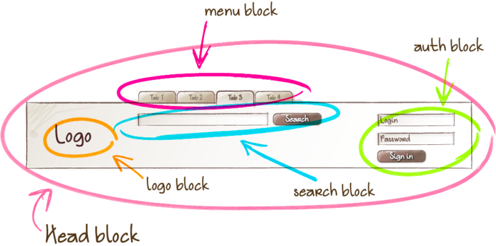
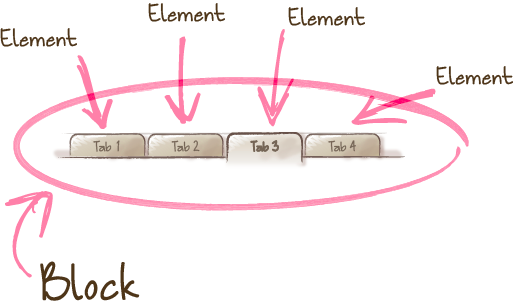

# 使用BEM命名规范来组织CSS代码

>BEM 是 Block（块） Element（元素） Modifier（修饰器）的简称
>使用BEM规范来命名CSS，组织HTML中选择器的结构，利于CSS代码的维护，使得代码结构更清晰（弊端主要是名字会稍长）

## 块元素(Block)



## 元素(element)



## 修饰器(Modifier)


## 如何使用BEM

一个独立的（语义上或视觉上），可以复用而不依赖其它组件的部分，可作为一个块（Block）
属于块的某部分，可作为一个元素（Element）
用于修饰块或元素，体现出外形行为状态等特征的，可作为一个修饰器（Modifier）

在本规范中，以双下划线 `__` 来作为块和元素的间隔，以双连字符`--`来作为块和修饰器 或 元素和修饰器 的间隔，以中划线`-`来作为 块|元素|修饰器 名称中多个单词的间隔

保证各个部分只有一级`B__E--M`，修饰器需要和对应的块或元素一起使用，避免单独使用

```html
<!-- 某个块 -->
<form class="search-form">
    <!-- 某个元素 -->
    <div class="search-form__content-left">
        <!-- 错误：不能出现多个元素(元素之间不能嵌套) -->
        <h2 class="search-form__content-left__h2">标题</h2>
        <!-- 某个元素，虽然是子集，保证了只有一级元素 -->
        <input class="search-form__input">
        <!-- 某个元素，加上了hover修饰器 -->
        <button class="search-form__button search-form__button--hover">搜索</button>
        <button class="search-form__button-set search-form__button-set--hover">搜索1</button>
        <!-- 错误：不能单独使用lg修饰器 -->
        <button class="search-form__button--lg">搜索</button>
        <!-- 块中可嵌套着另一个块 -->
        <p class="my-img">
            
        </p>
    </div>
</form>
<div class="search-result"></div>
```

在样式文件中，仅以类名作为选择器，不使用ID或标签名来约束选择器，且CSS（或者SCSS编译后的CSS）中的选择器嵌套不超过2层，增加效率和复用性，减少选择器之间的耦合度

比较常见的嵌套情景：需要通过块状态对内部元素进行调整时

```css
  .search-form {
    position: relative;
  }
  
  .search-form__input {
    font-size: 12px;
  }
  
  .search-form__button--hover {}
  
  /* 避免：避免使用不必要的嵌套（此处只是简单的嵌套，没有必要） */
  .search-form__content-left .search-form__input {}
  
  /* 稍好的嵌套（此处是在块的theme1修饰器下的子元素，某些时候有必要） */
  .search-form_theme1 .search-form__input {}
  
  /* 错误：使用了标签 */
  button.search-form__button {}
  .search-form button {}
```

而在SASS文件中，也需要注意嵌套层次的意义，尽量按照 BEM三层来

```css
/* 避免这样做 .search 不是一个独立的块 */
.search {
  /* 应该把这个块提取出来 */
  &-form {
    &__button {
      &--hover {}
      /* 应该把这个元素提取出来 */
      &-set {
        &--hover {}
      }
    }  
  }
  &-result {
  }
}
/* 建议这样,按照各级区分出来 */
.search-form {
  &__button {
    &--hover {}
  }
  &_button-set {
    &--hover {}
  }
}
.search-result {
}
/* 对于嵌套在块中的块，如果非常有必要，可以嵌套写样式 */
.search-form {
  .my-img {
    &__logo {}
  }
}
/* 但一般来说，不建议，因为这破坏了块的独立性。可转换成设置对应的 元素来表现，如 */
.search-form {}
.my-img {
  &__search-form-logo {}
}
```

BEM 规范虽然结构比较清晰，但有时候会产生代码冗余。
